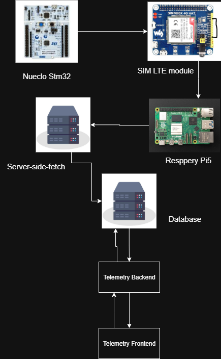

# Vehicle Telemetry System 

> telemetry platform that collects car signals on an **STM32**, relays them via **Raspberry Pi 5**, **LTE Module **, persists on a server‑side database, and exposes data to a **frontend dashboard**.


Collect signals on **STM32**, send via **Raspberry Pi 5 + SIM7600X (LTE)** to a backend, store in DB, and visualize in a frontend.


---


## System Diagram


---

## Repo Map
```

Telemetry-System-AAM/
├─ Resppery\_pi\_LTE\_Module/   # Pi + LTE modem code & docs (AT, bring-up, sender)
├─ Stem\_32/                  # STM32 firmware (Nextion + Telemetry UART)
├─ telemetry-backend/        # API/ingest + DB access
├─ telemetry\_frontend/       # Dashboard UI
├─ Server-side-fetch/        # Server↔Pi control/sync
├─ Graphes/                  # Legacy charts
├─ Temperature/              # Legacy temp demo
├─ assets \_front/            # Frontend assets
├─ Diagram.png
└─ Readme.md

```

**Key docs**
- Pi/LTE setup & AT commands: `Resppery_pi_LTE_Module/doc.md`, `Resppery_pi_LTE_Module/At_commands.txt`
- STM32 wiring & CubeIDE notes: `Stem_32/docs.md`
- Pi sender script: `Resppery_pi_LTE_Module/newlast.py`

---

## End-to-End Flow 
1. **STM32** reads signals and prints telemetry lines on **UART5** (e.g., `speed=42`), updates **Nextion** over **UART4**.
2. **Raspberry Pi 5** reads STM32 via **USB-UART (CH340)**, brings LTE up (SIM7600X), and runs `newlast.py` to send data to the **backend endpoint**.
3. **Backend** validates and stores data in the **database**.
4. **Frontend** queries the backend to show live tiles and charts.
5. **Server-side-fetch** can push configs/commands to the Pi when needed.

---

## Quick Start 
- **STM32**
  - Open `Stem_32` project in **STM32CubeIDE** and flash `main.c`.
  - UART4 @ 9600 to **Nextion**, UART5 @ 115200 to **CH340 → Pi**. Share GND.

- **Raspberry Pi 5 + LTE**
  - Use official PSU. Insert SIM (Orange), attach antennas.
  - Follow `Resppery_pi_LTE_Module/doc.md` to bring up modem (USB or UART). Test **AT** first.
  - Run the sender:
    ```bash
    cd ~/Resppery_pi_LTE_Module
    python3 newlast.py --stm-port /dev/ttyUSB0 --baud 115200
    ```
  - (Optional) Add a cron `@reboot` entry as shown in the doc.

- **Backend & DB**
  - Start the API and DB from `telemetry-backend/` (env and ports per that folder’s README).

- **Frontend**
  - Start the UI from `telemetry_frontend/` and point it to the backend URL.

---

## Interfaces 
- **Edge → Backend**: Pi posts batches over HTTPS (URL/API key defined in `newlast.py` or `.env`).
- **Frontend → Backend**: HTTP/WS for charts, tiles, and live updates.
- **Server-side-fetch ↔ Pi**: control/diagnostics channel (pull/push).

---

## Notes
- Use **USB-UART (CH340)** for STM32 so the modem can keep its own port.
- Always test with **AT commands** before running the Pi script.
- Keep power clean (official Pi PSU) to avoid brownouts on LTE attach.


* *Server-side-fetch* is the service that pulls from the **server to the Raspberry Pi** (e.g., configs/commands) and can also be used for pushing buffered data upward.
* *telemetry-backend* and *telemetry\_frontend* together present data to users and read/write the database.

---

---

## 2) Objectives (Why this exists)

* Unified pipeline for **real‑time** and **historical** vehicle data.
* Clear interfaces between **firmware**, **edge**, **backend**, and **UI**.
* Production‑grade concerns: security, reliability, observability, maintainability.

---

## 3) Components & Responsibilities

### 3.1 STM32 (on‑vehicle acquisition)

* Read signals: **speed, fuel level, GPS, brakes, engine/motor health**, etc.
* Timestamp and package readings.
* Send frames to Raspberry Pi via **UART or CAN**.

### 3.2 Raspberry Pi 5 (edge agent)

* Ingest frames from STM32; basic validation and buffering.
* Uplink telemetry to server (store‑and‑forward when offline).
* Receive configs/commands from **Server‑side‑fetch** service (server→edge channel).

### 3.3 Server‑side‑fetch (control plane)

* Publishes configuration/OTA commands down to Pi.
* Optionally requests diagnostics or cached batches from edge.

### 3.4 Telemetry Backend (data plane)

* **Ingest**: authenticate, validate, and queue incoming batches.
* **Process**: normalize/enrich; persist to time‑series DB; archive raw.
* **Read API**: serve filtered queries and live streams to the frontend.

### 3.5 Frontend Dashboard (experience)

* Live tiles (Speed/RPM/Fuel/Brake), historical charts, trip map.
* Alerts and system health views.

---

## 4) High‑Level Data Flow

1. **Acquire**: STM32 samples signals at a fixed rate.
2. **Transfer**: Frames move to Raspberry Pi via UART/CAN.
3. **Edge Handling**: Pi validates, buffers if offline, and **uplinks** to server.
4. **Ingest → Process**: Server authenticates, normalizes, and writes to DB.
5. **Query/Stream**: Frontend fetches history and subscribes to live updates.
6. **Control**: Server‑side‑fetch delivers configs/commands to the Pi on demand.

---

## 5) Interfaces (no payloads yet; just contracts)

* **Edge Uplink Interface** → Endpoint/topic used by Pi to send batches to server.
* **Edge Control Interface** → Channel for server→Pi commands/config.
* **Read API** → Endpoints for dashboards to query metrics/time ranges and to subscribe to live updates.


---

## 6) Data Model 

* **Vehicle**: id, vin, label.
* **Device**: id, type (stm32/pi), belongs\_to vehicle.
* **Telemetry Point**: vehicle\_id, timestamp, (speed, rpm, fuel, brake, gps, temps, voltages…).
* **Event/Alert**: vehicle\_id, timestamp, rule\_id, severity, message.
* **Trip**: vehicle\_id, start\_ts, end\_ts, summary stats.


---

## 7) Environments

* **Dev (local)**: single‑node DB + backend + UI.
* **Edge Lab**: Raspberry Pi in lab network for integration.
* **Prod**:  DB, horizontally scalable API, secured edge connectivity.

---


## 10) Milestones

* **M1 — Architecture Freeze**: finalize signals, interfaces, and ERD.
* **M2 — Vertical Slice**: one signal flows STM32 → Pi → DB → dashboard live tile.
* **M3 — Robust Edge**: offline buffering + retry + control channel verified.
* **M4 — Dashboards**: live map, charts, and alerting views.


---

## 11) Open Questions

* Exact **signal list & rates** per vehicle model?
* Preferred **uplink mode** (HTTPS batching vs. MQTT streaming) for prod?
* **Control payloads** (what configs/commands are needed day‑1)?
* Final **cloud provider** and DB choice (Timescale/Postgres vs. alternatives)?

---


